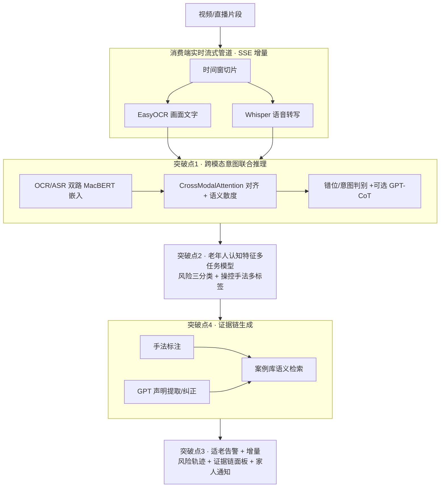
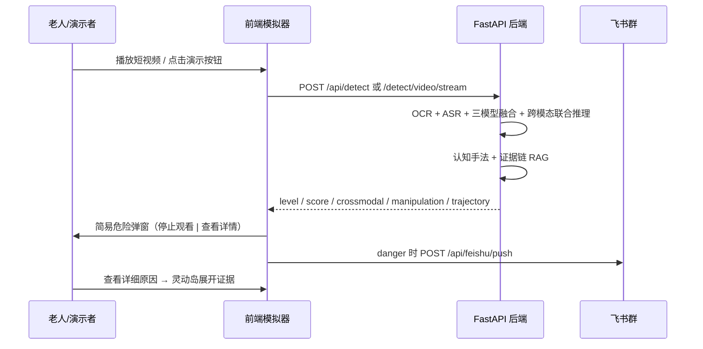

# 🛡️ FactSafe · 老人短视频虚假信息检测系统

面向老年人短视频诈骗的**消费端**多模态实时检测与可解释预警系统。

## 📋 选题背景与定位：填补大厂风控的结构性盲区

抖音/快手/微信视频号等平台已有强大的内容风控，但其机制存在**四个结构性盲区**，
恰恰是针对老年人的诈骗高发地带。FactSafe 不与平台拼通用识别能力，而是**站在老人（消费端）这一侧**补齐这些盲区：

| 大厂风控盲区 | 成因 | FactSafe 的差异化突破 |
|---|---|---|
| **跨模态错位** 漏检 | 平台多为"单模态独立分析+简单融合" | **突破点1 跨模态意图联合推理**：字幕合规但语音诈骗的伪装也能识别 |
| **老人专属话术** 用通用模型 | 通用反诈模型未针对老人认知特点建模 | **突破点2 老年人认知特征多任务模型**：显式识别情感操控/权威伪造/利益诱导/紧迫感/AI合成 |
| **只在发布时审一次** | 生产端审核存在时间差，直播/二次剪辑易漏 | **突破点3 消费端实时流式增量推理**：观看即检测，风险随观看进度升级 |
| **黑盒"有风险"提示** 老人不信 | 平台不解释原因、不给证据 | **突破点4 证据链级可解释**：手法标注 + GPT 声明纠正 + 关联真实案例 |

### 🎯 核心功能

- 🔀 **跨模态意图联合推理**：分通道评估画面文字(OCR)与语音(ASR)风险并计算语义散度，识别"用合规外壳掩盖诈骗"的错位伪装
- 🎭 **老年人认知操控手法识别**：多任务模型同时输出风险等级与诈骗手法多标签
- ⏱️ **消费端实时流式防护**：SSE 增量推理，逐时间窗推送 `progress_risk`，风险随观看进度动态升级
- 📚 **证据链可解释**：为什么有风险、用了什么手法、别人因类似套路损失多少（关联真实案例库）
- 📱 **分级家人通知**：高风险自动联动家人（多通道 + 频率限制 + 敏感度策略）
- 🌐 **适老 & 多语**：大字体/高对比/语音告警，支持普通话/粤语/English

### 🧪 技术架构



底座能力：MacBERT 文本分类(F1≈0.93) + TF-IDF 集成 + 双语规则引擎加权融合；GPT(HKBU GenAI) 异步事实核查；全链路 PII 脱敏。

## 🖥️ 前端设计与端到端流程

### 页面结构（React + TypeScript）

```
App.tsx（顶栏：品牌 / 竞赛演示开关 / 语言）
 └── MobileSimulator（主舞台）
      ├── phone-stage（70%）— iPhone 17 Pro 框 + 短视频 + 灵动岛告警 + 简易危险弹窗
      └── detection-panel（30%）— 实时 OCR 文本流、扫描日志、风险分、证据链摘要
 └── Settings（常规模式）— 敏感度、飞书/企微、适老化字体
```

| 组件 | 职责 |
|------|------|
| `MobileSimulator` | 模拟抖音式上下滑；内置 12 条剧本视频 + 3 条真实 MP4；检测完成弹出「停止观看 / 查看详细原因」 |
| `DetectionFloater` | 灵动岛药丸 + 展开详情（跨模态、手法、建议） |
| `RiskAlertModal` | 危险首屏：一句提醒，无长文解释 |
| `FileUpload` | 上传视频 → SSE 流式检测 → 跨模态/轨迹/证据链面板 |
| `OpenClawService` | 高风险 → `POST /api/feishu/push` 推送到家人群 |

语言仅 **中文 / English**（顶部 `中` ↔ `EN`）。

### 用户一次检测的完整流程



## 🚀 快速开始

### 环境要求

- Python 3.9+
- Node.js 18+ (前端开发)
- CUDA 11.8+ (GPU训练，可选)

### 安装步骤

```bash
# 1. 克隆项目
git clone https://github.com/yourusername/Fact-Safe-Elder.git
cd Fact-Safe-Elder/tyt

# 2. 安装后端依赖
cd backend
pip install -r requirements.txt

# 3. 启动后端服务
python -m uvicorn app.main:app --host 127.0.0.1 --port 8000

# 4. 安装前端依赖 (可选)
cd ../frontend
npm install
npm start
```

打开：
- 前端：`http://localhost:3000`
- 后端：`http://localhost:8000`
- Swagger：`http://localhost:8000/docs`

### 🎬 竞赛演示模式（答辩推荐）

顶部打开 **「竞赛演示模式」** 开关后，系统将自动：

| 行为 | 说明 |
|------|------|
| 隐藏非演示 UI | 设置入口、统计数字、主题切换等收起，只保留语言切换与演示开关 |
| **70% / 30% 一屏布局** | 左侧 iPhone 17 Pro 模拟器（短视频播放），右侧实时检测面板 |
| 锁定「宁漏勿误」 | `sensitivity=low` → 后端 `precision`，降低演示误报 |
| 资源预加载 | `/health` 探活、推理预热、3 条 Demo MP4 预加载、飞书 Webhook 同步 |
| 一键播片 | 「保健品诈骗 / 金融诈骗 / 安全科普」按钮，点击即切换并触发检测 |

实现见 `frontend/src/demoMode.ts`、`App.tsx` 顶部开关。

### 📹 上传视频验证（推荐体验）
- 进入前端 Tab：**“📹 上传视频验证”**
- 上传视频（`video/*`）
- 系统会自动：
  - 抽取关键帧（opencv 可用时）
  - OCR提取画面字幕/大字（easyocr 或 pytesseract 可用时）
  - Whisper转写语音（whisper 可用时）
  - 综合判断风险等级并给出解释

### Docker部署

```bash
docker-compose up -d
```

## 📊 数据集（诚信说明）

> ⚠️ **数据诚信**：早期 `comprehensive_training_set.json` 标称 1,523 条，但**去重后仅 38 条唯一文本**（97.5% 为重复），
> 这是此前评估指标异常偏高的根因。本项目已正视该问题：去重后重建数据集、用真实留出集评估、并清理了误导性的 `.mock_dataset` 标记。

| 数据集 | 描述 | 用途 | 真实规模 |
|--------|------|------|--------|
| `elder_scam_labeled.json` | **老年人专属诈骗多标签集**（风险三分类 + 5 类操控手法）。**84% 来自真实开源数据**：真实微博谣言 + 真实新闻标题；其余为人工种子精标 + 弱监督 + 模板增强（手法信号） | 突破点2 认知特征模型训练 | **1,903 条**（real_open_source 1600 / template_aug 240 / weak_auto 38 / seed_manual 25，均带 `label_source` 可追溯） |
| `chinese_rumor_thu/rumors_v170613.json` | **真实开源**·thunlp 中文谣言数据集（新浪微博不实信息举报平台，31,669 条） | 真实 danger 正样本来源 | 31,669 条（采样接入） |
| `chinese_rumor_thu/toutiao_cat_data.txt` | **真实开源**·今日头条新闻标题分类集（正常新闻，38 万条） | 真实 safe 负样本来源 | 382,688 条（采样接入） |
| `crossmodal_mismatch_eval.json` | **跨模态错位 OOD 评测集**（错位/双模态诈骗/双模态安全） | 突破点1 联合推理对照实验 | 18 组 OCR/ASR 配对 |
| `scam_case_library.json` | **结构化真实诈骗案例库**（类别/话术/受害人数/平均损失/官方来源） | 突破点4 证据链案例检索 | 12 类典型案例 |
| `comprehensive_training_set.json` | 历史综合训练集（去重后并入） | 文本底座参考 | 去重后 38 条唯一 |

> 真实开源数据来源：[thunlp/Chinese_Rumor_Dataset](https://github.com/thunlp/Chinese_Rumor_Dataset)（谣言正样本）、[今日头条文本分类数据集](https://github.com/aceimnorstuvwxz/toutiao-text-classfication-dataset)（正常新闻负样本）。
> 运行 `python scripts/build_elder_cognitive_dataset.py --real-rumor 800 --real-safe 800` 即可复现接入。

数据生成（纯 Python，无需 GPU）：

```bash
python scripts/build_elder_cognitive_dataset.py     # 生成老年人认知特征多标签集
python scripts/gen_test_videos.py --eval-set        # 生成跨模态错位评测集
```

## 🏋️ 模型训练

### 本地训练

```bash
# 使用默认参数训练
python train_multimodal_model.py

# 自定义参数
python train_multimodal_model.py \
    --epochs 10 \
    --batch_size 16 \
    --learning_rate 2e-5 \
    --output_dir ./models \
    --fp16
```

### Google Colab训练
（可选）如需在Colab训练，直接上传本仓库并运行 `train_multimodal_model.py`。

## 📁 项目结构

```
Fact-Safe-Elder/
├── backend/                 # 后端服务 (FastAPI)
│   ├── app/
│   │   ├── main.py         # FastAPI 主入口
│   │   ├── core/           # 核心模块
│   │   │   ├── pii_redaction.py        # PII 脱敏
│   │   │   └── manipulation_taxonomy.py # 老年人认知操控手法分类法(突破点2/4共用)
│   │   ├── services/       # 业务逻辑
│   │   │   ├── multimodal_detector.py  # 多模态检测器 + 认知模型 + 跨模态联合推理
│   │   │   ├── gpt_fact_checker.py     # GPT 异步事实核查 + 跨模态CoT
│   │   │   ├── case_retriever.py       # 诈骗案例库语义检索(证据链)
│   │   │   ├── family_notification.py  # 家人通知 + 多级预警
│   │   │   └── dataset_loader.py       # 数据加载
│   │   └── api/            # API 路由
│   └── requirements.txt
├── frontend/               # 前端应用 (React)
│   ├── src/
│   │   ├── components/     # React 组件
│   │   └── services/       # 前端服务
│   └── package.json
├── data/                   # 数据集与评估结果
│   └── raw/               # 原始训练数据
├── models/                # 训练好的模型文件
├── scripts/               # 训练、导出、统计等辅助脚本
├── test_videos/           # 测试视频
├── report_screenshots/    # 报告截图
├── docker-compose.yml     # Docker 部署配置
├── start.sh               # 一键启动脚本
└── README.md              # 项目说明与安装指南
```

## 🔌 API接口

### 检测接口

```bash
POST /detect
Content-Type: application/json

{
    "text": "投资高收益理财产品，保本保息年化30%",
    "source": "test"
}
```

响应示例:
```json
{
    "success": true,
    "message": "检测完成",
    "data": {
        "level": "danger",
        "score": 0.92,
        "confidence": 0.88,
        "message": "⚠️ 高风险：检测到疑似诈骗信息",
        "reasons": ["金融风险词汇: 高收益, 保本保息, 年化"],
        "suggestions": ["投资需谨慎，高收益往往伴随高风险"]
    }
}
```

### 健康检查

```bash
GET /health
```

## 🔬 四大技术突破 · 训练与评估

```bash
# 突破点2：训练老年人认知特征多任务模型（风险三分类 + 操控手法多标签）
python scripts/train_elder_cognitive_model.py --epochs 6 --batch_size 16
#   产物 elder_cognitive_model.pt 会被后端 lifespan 自动发现并加载；
#   未训练时 detect() 自动用弱监督规则兜底，能力始终可演示。

# 突破点1：单模态独立融合 vs 跨模态联合推理 对照实验
python scripts/eval_crossmodal.py        # 输出 scripts/crossmodal_eval_results.json

# 真实统计检验（替换原硬编码 F1/SUS）：5折CV 模型 vs 规则 + 跨模态配对检验
python scripts/statistical_tests.py      # 输出 scripts/statistical_tests_results.json

# 留出集整体评估（在自建老人标注集上 30% 留出，TF-IDF 仅用训练分片即时训练，杜绝泄漏）
python scripts/run_evaluation.py         # 输出 evaluation_results.json
```

### 真实评估结果（可复现，非硬编码）

> 全部数字由上述脚本在 `data/raw/elder_scam_labeled.json` 等真实标注集上实测产出，结果落盘为对应 JSON，可直接复跑核对。

| 实验 | 指标 | 结果 | 产物 |
| --- | --- | --- | --- |
| 5 折交叉验证：TF-IDF 模型 vs 关键词规则基线（**真实数据**） | 平均 F1（配对 t 检验） | 模型 **0.938 ± 0.014** vs 规则 **0.471**，**p<0.001（高度显著）** —— 真实多样谣言上规则基线大幅失效，凸显模型价值 | `scripts/statistical_tests_results.json` |
| 留出集整体评估（91 条留出，最优融合） | Acc / F1 | **97.8% / 0.988**（BERT-only F1 0.865，规则 recall 偏低如实呈现） | `evaluation_results.json` |
| 跨模态：单模态融合 vs 联合推理（18 条错位集） | 整体准确率 / 错位检出率 | 二者 **0.833 / 1.000**（错位均可检出；联合推理另产出 visual/audio/散度可解释信号） | `scripts/crossmodal_eval_results.json` |
| 认知特征多任务模型（6 epoch CPU） | risk acc / 手法 micro-F1 | **0.984 / 0.643** | `elder_cognitive_model.pt`（训练日志） |
| SUS 可用性 | — | **待真实老年用户测试采集**（诚信原则，未采集前不提供任何分数） | `data/raw/uat_sus_scores.json`（待补） |

关键 API（突破点在响应中体现）：
- `POST /detect/video/stream`（SSE）：新增 `progress_risk` 事件（增量风险升级）、`conflict`（跨模态错位）、`evidence`（证据链）
- 检测响应新增字段：`manipulation_features` / `manipulation_detail`（手法标注）、`crossmodal`（visual/audio_risk、divergence）、`risk_trajectory`（风险轨迹）、`evidence_chain` + `related_cases`（证据链与案例）
- `POST /notify-family`：接通真实 `FamilyNotificationService` + `MultiLevelAlertSystem`（多通道/频率限制/敏感度策略）
- 设 `ENABLE_CROSSMODAL_COT=1` 可开启 GPT 多模态思维链解释（默认关闭以保证演示低延迟）

## 🗺️ 商业模式与未来路线图

FactSafe 的定位是平台风控的**消费端补充层**，可沿以下路线演进：

- **平台反诈 SDK**：将"跨模态联合推理 + 认知手法识别 + 证据链"封装为 SDK / 旁路服务，供平台在播放端调用，补齐发布端审核时间差盲区。
- **适老硬件融合**：结合毫米波雷达/摄像头的"观看陪伴"硬件，在老人观看高风险内容并出现转账意图时本地预警并联动家人。
- **反诈保险**：与保险机构合作推出"防诈险"，以系统风险评分与证据链作为风控与理赔依据。
- **开放银行联动**：高风险 + 转账行为触发时，经用户授权对接开放银行接口做转账二次确认/冷静期。
- **家庭守护订阅**：面向子女的订阅式家庭守护（分级通知、周报、可疑内容回溯）。

> 上述为产品路线设想；当前仓库已落地的是消费端检测内核与可解释证据链，硬件/保险/SDK 为后续工程化方向。

## 📚 参考论文

1. **FakeSV** - "A Multimodal Benchmark with Rich Social Context for Fake News Detection on Short Video Platforms" (AAAI 2023)
2. **SpotFake** - "A Multimodal Framework for Fake News Detection" (IEEE BigMM 2019)
3. **Chinese-BERT-wwm** - "Pre-Training with Whole Word Masking for Chinese BERT"

## 🤝 贡献指南

欢迎提交Issue和Pull Request!

## 📄 许可证

MIT License

## 📞 联系方式

如有问题，请提交Issue或联系项目维护者。
